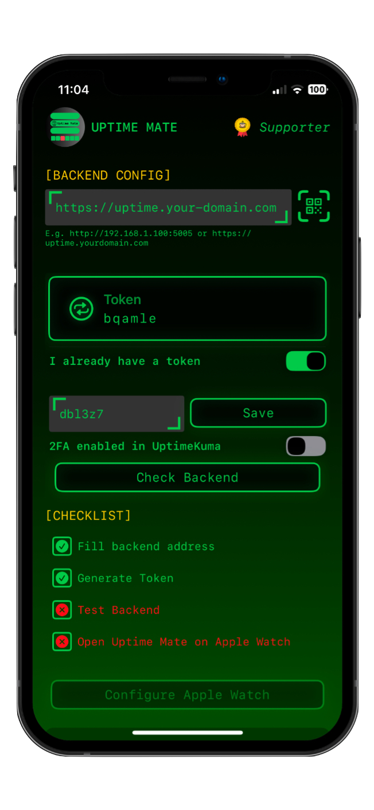

# Uptime Buddy

Uptime Buddy is in beta testing phase.
You can join the beta via TestFlight
[https://testflight.apple.com/join/okTxZGX1](https://testflight.apple.com/join/okTxZGX1)

Uptime Buddy is an uptime monitoring tool for your Apple Watch, designed to keep you informed about the status of your services. To utilize Uptime Buddy, you need to deploy a backend server that interacts with the app, leveraging the power of Uptime Kuma and Uptime Kuma API.





## Installation via Docker

Follow the steps below to set up the backend for Uptime Buddy using Docker.

### Prerequisites
Install the Uptime Buddy app from the Apple App Store on your Apple Watch.
Ensure you have a running instance of Uptime Kuma.
Docker Compose Configuration
Create a docker-compose.yml file with the following content to deploy the backend:

```yaml
services:
  uptime-buddy-api:
    image: schech1/uptime-buddy-api:latest # x86
    # image: schech1/uptime-buddy-api:latest-arm64 # arm64
    ports:
      - "5005:5005"
    environment:
      - UPTIME_KUMA_URL=YOUR_UPTIME_KUMA_URL # e.g. http://192.168.1.34:3002/
      - USERNAME=YOUR_UPTIME_KUMA_USERNAME
      - PASSWORD=YOUR_UPTIME_KUMA_PASSWORD
```

Replace the environment variables with your actual Uptime Kuma URL, username, and password.

## Deploying the Backend
Save the docker-compose.yml file.

Run the following command in the directory containing the docker-compose.yml file:

```sh
docker-compose up -d
```

This command will pull the necessary Docker image and start the backend service on port 5005.

## Settings on the iOS App
After deploying the Docker container, open the Uptime Buddy app on your Apple Watch and configure the backend URL. Use the address of the server where you deployed this container, including the port (e.g., http://your-server-ip:5005).

## Related Projects

This project is based on Uptime Kuma and uptime-kuma-api.

[Uptime Kuma](https://github.com/louislam/uptime-kuma): A self-hosted monitoring tool to monitor uptime for websites, applications, and APIs.
[uptime-kuma.api](https://github.com/lucasheld/uptime-kuma-api): An API for Uptime Kuma, enabling integration with various applications.


## Contributing

We welcome contributions! 

## Support

If you encounter any issues or have questions, please open an issue on our GitHub repository.